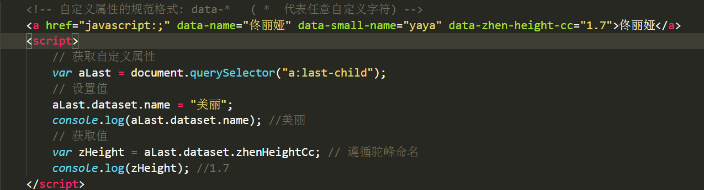
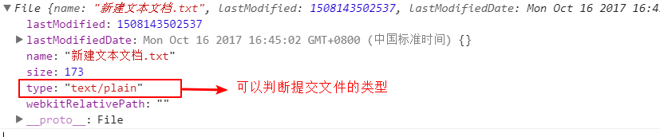
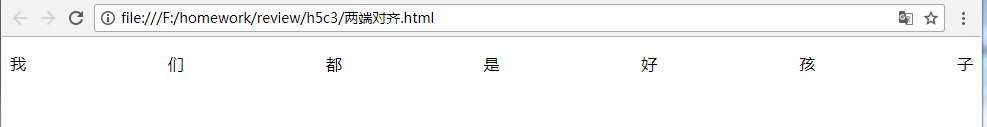
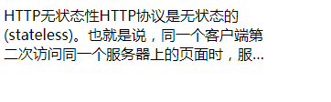

## H5新增js属性
### 获取元素的方法
1. `querySelector(模拟css选择器)`:获取单个元素
2. `querySelectorAll(模拟选择器)`:获取伪数组

### 类名操作
1. 添加类：元素.classList.add("类名");
2. 删除类：元素.classList.remove("类名");
3. 切换类：元素.classList.toggle("类名");
4. 是否包含类：元素.classList.contains("类名"),有这个类，返回true，没有返回false

### 自定义属性
自定义属性的规范格式：data-* (*代表任意字符)

## H5新增API
### 网络状态检测
网络状态检测的事件（h5网络状态检测API）
1. online 在线
```javascript
window.addEventListener("online",function(){

})
```
2. offline 离线  
```javascript
window.addEventListener("offline",function(){

})
```
  **注意**：   
      1. 检测网络状态变化的瞬间的情况  
      2. 检测的是正常情况的（wifi，局域网）

### 多媒体
1. 属性  

    属性名| 功能 
    -|-
    duration    | 返回当前音频或视频的长度（以秒记）              
    paused      | 音频/视频是否暂停,只能获取值，不能赋值（有这个属性暂停，没有播放） 
    currentTime | 设置或返回音频/视频中的当前播放位置（以秒记）   
    ended       | 返回音频/视频的播放是否已结束(不用)                
2. 事件
    功能| 事件名
    - | -
    当文件就绪可以开始播放时运行的脚本（缓冲以足够开始时）        | oncanplay
    当播放位置改变时（比如当用户快进到媒介中一个不同的位置时）运行的脚本 | ontimeupdate
    当媒介已到达结尾时运行的脚本（可以发送类似“感谢观看”之类的消息）| onended     

3. 方法
    方法名  | 功能 
    - | -
    play()  | 开始播放音频/视频  
    pause() | 暂停当前播放的音频/视频
    **注意**：z-index必须大于（10位）2147483647（全屏时显示自己的控制条）   
    视屏全屏时去除掉默认的控制条样式
    ```css
    video::-webkit-media-controls-enclosure {
        display: none !important;
    }
    ```
4. video属性
    ```html
    <video src="路径" width="" height="" poster="视频封面图片路径">
    ```
### WebStorage API
#### 什么是WebStorage  
1. 定义：WebStorage指的是客户端存储，这里指的是浏览器端存储  
2. 举例：网站自动登录功能
3. 原理：把一些少量的数据存储在浏览器等客户端中，减少没必要的请求到服务器，降低服务器的压力，给用户提供更好的体验

#### WebStorage的三种存储方式（面试重点）
1. cookie  
    1. 广泛使用
    2. 存储量4kb左右
    3. 会在浏览器和服务器间传递
    4. 一般由服务器创建  
    5. 可以设置存储时间（默认和session一样）
    6. cookie不容易操作
2. session(会话)Storage
    1. H5新增
    2. 存储量5M左右
    3. 只会在浏览器存储数据（浏览器的内存中）
    4. 只会由浏览器端创建
    5. 存储时间：打开浏览器开始，关闭浏览器消失
    6. 方法简洁明了，容易操作
3. local(本地)Storage
    1. H5新增
    2. 存储量5M左右
    3. 只会在浏览器存储数据（存储在硬盘中）
    4. 只会由浏览器端创建
    5. 永久存储除非手动删除
    6. 方法简洁明了，容易操作 

**sessionStorage**  
方法| 功能
- | -
window.sessionStorage.setItem(key,value) | 添加数据
window.sessionStorage.getItem(key)       | 获取数据
window.sessionStorage.removeItem(key)    | 移除数据
window.sessionStorage.clear()            | 清除数据 
window.sessionStorage.key(n)(n从0开始，key按unicode编码排序) | 获取key
> 应用场景：存储一些少量的临时数据

**localStorage**  
方法                                       | 功能
- | -
window.localStorage.setItem(key,value)   | 添加数据
window.localStorage.getItem(key)         | 获取数据
window.localStorage.removeItem(key)      | 移除数据
window.localStoraeg.clear()              | 清除数据
window.sessionStorage.key(n)(n从0开始，key按unicode编码排序) | 获取key
> 应用场景：网页换肤 京东购物车

### 拖拽
1. 拖拽元素和目标元素  
    拖拽元素：除了img标签，要想成为拖拽元素，必须给标签设置draggable="true"
    ```html
        <div id="dragelement" draggable="true">我是拖拽元素</div>
    ```
    目标元素：拖拽元素被拖拽到的目标位置的元素  

2. 拖拽元素的事件 
    事件        | 功能
    - | -
    dragstart | 用户拖动一个元素或者一个选择文本的时候dragstart会触发
    drag      | 用户完成dragstart之后，拖动元素的过程中,drag事件会一直触发
    dragend   | 用户结束拖动元素的时候，dragend事件触发 

3. 目标元素的事件
    (注意：<font color="red">在dragover中一定要执行e.preventDefault(),否则drop事件不会触发</font>)    

    事件    | 功能
    - | -|
    dragenter | 拖拽元素（其实是鼠标进入目标元素）进入目标元素边缘范围的时候，dragenter事件触发
    dragover  | 拖拽元素在目标元素范围内，dragover会一直触发
    drop         | 拖拽元素被释放到一个有效的目标元素时，drop事件会触发

4. 传递数据（拖拽对象用来传递的媒介）  
    事件                                 | 功能 
    - | -
    ev.dataTransfer.setData(key,value) | 设置拖动数据
    ev.dataTransfer.getData(key)       | 获取拖动数据
    ev.dataTransfer.files            | 本地文件列表

### 文件读取
> 前端并没有读取文件内容的能力，预览文件比较困难，在html5中新增了文件读取API  

拖拽读取获取文件信息的方法：e.dataTransfer.files[0]
   
判断文件的类型：   
  
利用input表单提交文件获取文件信息的方法：input.files[0]  
文件读取的步骤：  
1. 实例化FileReader对象
2. 使用FileReader对象的方法读取文件  
  读图片：readAsDataURL() result属性中包含data:url格式的字符串表示所读取文件的内容  
  读文本：readAsText() result属性中将包含一个字符串以表示所读取的文件内容
3. 等待读取操作完成（事件）  
  onload 当读取文件完成时调用
4. 通过result属性获取文件内容
```javascript
// 获取目标元素 
var dropArea = document.getElementById("drop_area");

// 阻止浏览器默认打开图片或读取文件信息的默认行为
// 只要拖动到浏览器页面内，浏览器就会打开文件，
// 所以要将整个页面的默认行为都阻止
document.ondragover = function(ev){
    ev.preventDefault();
}

// 将文件拖拽到目标区域
dropArea.ondrop = function(ev){
    // 阻止浏览器读取文件
    ev.preventDefault();
    // 获取文件的信息
    var file = ev.dataTransfer.files[0];
    // 利用FileReader对象读取文件信息
    var fread = new FileReader();
    // 判断文件类型进行读取
    if(file.type=="text/plain"){
        // 读取文本信息
        fread.readAsText(file);
        // 等待文件读取完毕
        fread.onload = function(){
            document.getElementById("preview").innerHTML = fread.result;
        }
    }
    else if(file.type=="image/jpeg"){
        // 读取图片的url
        fread.readAsDataURL(file);
        fread.onload = function(){
            document.getElementById("picture").src = fread.result;
        }
    }  
} 
```

### 地理定位
1. 获取一次地理定位的方法（回调）
```javascript
navigator.geolocation.getCurrentPosition(成功时的回调,失败时的回调,参数设置);
```
成功时回调函数对象的属性(position.coords)  
属性| 功能
- | -
**latitude**         | **纬度** 
**longitude**        | **经度** 
altitude          | 高度(海拔)
accuracy          | 精确度 
altitude Accuracy | 海拔精确度
heading           | 行进方向
speed             | 地面速度

失败时回调函数对象的属性(positionError.code)  
| 属性   | 功能 
- | -
0 | 不包括其他错误编号中的错误 
1 | 用户拒绝浏览器获取位置信息
2 | 尝试获取用户信息，但失败了
3 | 设置了timeout值，获取位置超时了

2. 实时获取地理位置的方法（回调）
```javascript
//实时获取定位
watchID = navigator.geolocation.getCurrentPosition(成功时的回调,失败时的回调,参数设置);
//清除获取
navigator.geolocation.clearWatch(watchID);
```
3. 获取地理位置信息的几种方法：
    1. GPS  特别精确 但是花的时间比较长
    2. wifi定位 比较精确 在农村比较难以实现
    3. IP定位  最不精确
    4. 手机信号(4G) 非常精确   安卓  iOS不行(权限的问题)
    5. 浏览器定位  非常不精确

### html和css小技巧
1. 改变表单placeholder中文字的样式
    ```css
    /* placeholder是伪元素 */
    input::placeholder {
        color:red;
        font-weight: bold;
    }
    ```
2. 俩端对齐  
    css代码
    ```css
    p {
        text-align: justify;
    }
    p:after {
        content:"";
        display: inline-block;
        width:100%;
        overflow: hidden;
    }
    ```
    html代码
    ```html
    <p>我们都是好孩子</p>
    ```
    页面效果
    
3. 多行超出显示...(点点点)  
    html和css代码
    ```html
    <style>
        p {
            width: 300px;
            /* 将对象作为弹性伸缩盒子模型显示 */
            display: -webkit-box;
            /* 设置或检索伸缩盒子对象的子元素的排列方式 */
            -webkit-box-orient: vertical;
            /* 限制在一个块元素显示的文本的行数 */
            -webkit-line-clamp: 3;
            overflow: hidden;
        }
    </style>
    <p>
        HTTP无状态性HTTP协议是无状态的(stateless)。
        也就是说服务器也无法分辨不同的客户端。
        HTTP的无状态特性简化了服务器的设计，
        使服务器更容易支持大量并发的HTTP请求。HTTP持久连接
    </p>
    ```
    页面效果  
    


